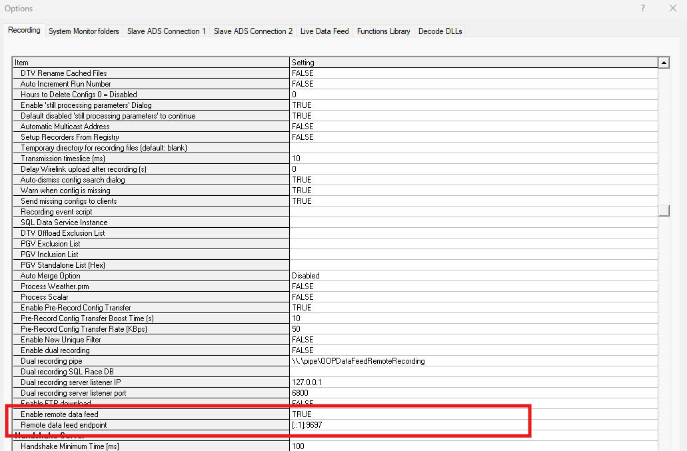

# Bridge Service

## Introduction
The Bridge Service decodes a raw stream of quads from an ATLAS Data Server (ADS), converting the data to engineering 
values then into the Stream Protocol via the Stream API. It includes components to manage sessions, configuration, 
metadata etc. 
All RDA protected data will be filtered out at this point, based on the active team license, so any downstream 
components will only receive data available to the team. 


## Configuration
Currently, the Bridge Service is installed with ADS and will share settings used by ADS, i.e. the licence used by ADS, 
and all the config, pgv and PUL files specified in ADS.

Bridge service uses the name of the ADS as the DataSource name. This can be configured within the ADS on 
Setup | General | General Network Settings | Name.

!!! note
    In the future, the config will be extended to support running Bridge service on a container and hence allowing users 
    to specify and fetch licences and all the required pgvs and configs from different user specified location


Bridge Service specific settings are stored in *"BridgeServiceConfig.json"*, which can be found in 
*../Documents/McLaren Electronic Systems/ATLAS9/BridgeService* folder. The data can be split multiple Kafka topics or 
partitions. For more, information please refer to 
[Stream Creation Strategy](../stream_api/stream_server.md/#stream-creation-strategy)


=== "Example with StreamCreationStrategy=2 (Topic based)"

    ```json title="BridgeServiceConfig.json" linenums="1" hl_lines="3"
    {
        "StreamApiConfig": {
            "StreamCreationStrategy": 2,
            "BrokerUrl": "localhost:9094",
            "PartitionMappings": [ {} ],
            "IntegrateSessionManagement": true,
            "IntegrateDataFormatManagement": true,
            "UseRemoteKeyGenerator": false,
            "RemoteKeyGeneratorServiceAddress": "",
            "BatchingResponses": false,
            "StreamApiPort": 13579
        },
        "StreamSelectionConfig": {
            "Auto": true,
            "Mappings": [ {} ]
        }
    }
    ```
=== "Example with StreamCreationStrategy=1 (Partition based)"

    ```json title="BridgeServiceConfig.json" linenums="1" hl_lines="3"
    {
        "StreamApiConfig": {
            "StreamCreationStrategy": 1,
            "BrokerUrl": "localhost:9094",
            "PartitionMappings": [ 
            {
                "Stream": "Stream1",
                "Partition": 1
            },
            {
                "Stream": "Stream2",
                "Partition": 2
            },
            {
                "Stream": "Stream3",
                "Partition": 3
            },
            {
                "Stream": "Stream4",
                "Partition": 4
            },
            {
                "Stream": "Stream5",
                "Partition": 5
            },
            {
                "Stream": "Stream6",
                "Partition": 6
            },
            {
                "Stream": "Stream7",
                "Partition": 7
            },
            {
                "Stream": "Stream8",
                "Partition": 8
            },
            {
                "Stream": "Stream9",
                "Partition": 9
            } ],
            "IntegrateSessionManagement": true,
            "IntegrateDataFormatManagement": true,
            "UseRemoteKeyGenerator": false,
            "RemoteKeyGeneratorServiceAddress": "",
            "BatchingResponses": false,
            "StreamApiPort": 13579
        },
        "StreamSelectionConfig": {
            "Auto": false,
            "Mappings": [  
            {
                "AppName": "ATLAS",
                "Stream": "Stream1"
            },
            {
                "AppName": "FIA",
                "Stream": "Stream2"
            },
            {
                "AppName": "Chassis",
                "Stream": "Stream3"
            },
            {
                "AppName": "Arbitrator",
                "Stream": "Stream4"
            },
            {
                "AppName": "Coordinator",
                "Stream": "Stream5"
            },
            {
                "AppName": "Controller",
                "Stream": "Stream6"
            },
            {
                "AppName": "Dash",
                "Stream": "Stream7"
            },
            {
                "AppName": "BrakeControl",
                "Stream": "Stream8"
            },
            {
                "AppName": "TAG320BIOS",
                "Stream": "Stream9"
            }  ]
        }
    }
    ``` 


!!! info
    Bridge Service logs are stored in a *"BridgeLogYYYMMDD.txt"* file, which can be found in *../Documents/McLaren Electronic Systems/ATLAS9/log* folder. 

## Setup

**Prerequisite:**

Kafka broker - The Bridge service needs to be configured to write to a Kafka broker. As you can see in the above example, the config file points to a broker url, which is hosting kafka locally on the same machine as the ADS.

To enable the Bridge Service, set "Enable remote data feed" setting to "True" in ADS | Tools | Options | Recording tab | General


Restart ADS once the setting is applied. 

Once the data is published on Kafka, users can use the Stream API to consume the data. For more information, please refer to the [Stream API Sample code](https://github.com/mat-docs/MA.Streaming.Api.UsageSample)

!!! note
    Currently, ADS will launch the Bridge Service in a separate command prompt for ease of testing/validation and diagnostics.

## UNIX Timestamps

Timestamps from McLaren Applied ECUs are relative to midnight local time. To convert the timestamps to UNIX epoch time in UTC, 
the date and the local timezone offset on the machine hosting the bridge service is used. 

!!! warning
    It also applies to File Telemetry Recorders and Multi-Session Offload Recorders in addition to live telemetry. 
    Replaying a raw file on a machine that is incorrectly configured could publish timestamps at the incorrect date and 
    timezone.
