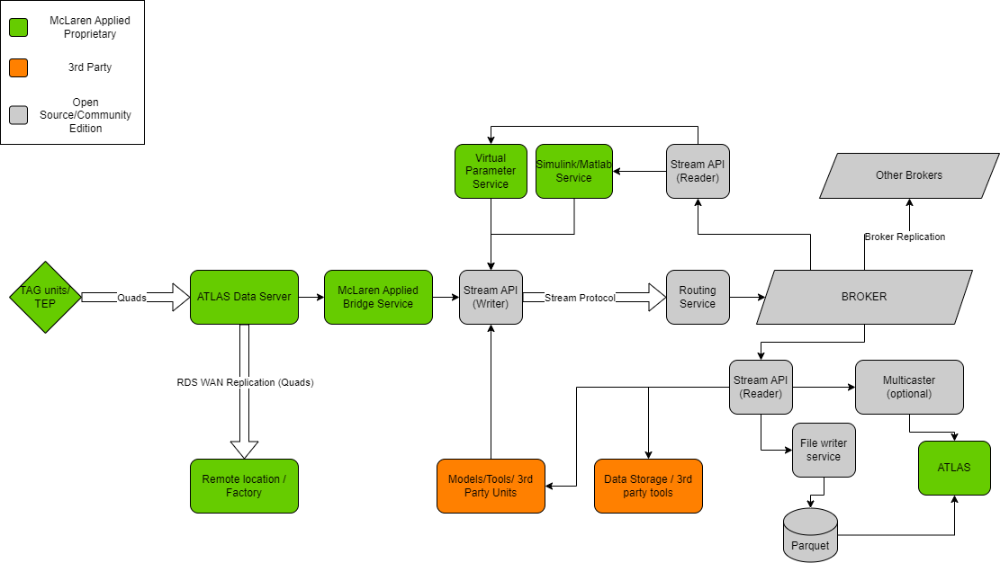

# Open Streaming Architecture
A standard, open set of rules and services for streaming telemetry data over a broker. Includes full definition of 
the Protobuf schema for transmitting messages, along with documentation describing the 
messages.
 

## Components

### [Stream API](stream_api/index.md)
A standard API to expose streaming data from SECU units and abstract away proprietary 
implementation details. Consumers of this API will be able to write software that 
interfaces with any viewer, network protocol, or storage technology of their choice. 
All the data from the SECU unit (after RDA filtering) will be available on the stream. 
This will be integrated with a protocol for streaming engineering (calibrated) 
telemetry, interoperating with ATLAS clients and the surrounding data processing 
ecosystem.

### Routing Service
The Routing Service aims to efficiently manage the transfer of data, specifically byte 
arrays, from source nodes (publishers or producers) to destination nodes (subscribers or
consumers). It utilizes broker technologies for message transmission, simulating 
real-world network routers. This service leverages a custom protocol, separates routing 
concerns from content, and offers extensibility and configurability. It adheres to the 
principle of Separation of Concerns, ensuring an organized and scalable architecture.

Currently, we have implemented this as part of the Stream API for ease of use and 
allows configuration of [stream creation strategy](stream_api/stream_server.md/#stream-creation-strategy).

### Bridge Service
Standalone service that decodes a raw stream of quads from an ADS, converting the data 
to engineering values then into the Stream Protocol via the Stream API. Will include 
components to manage sessions, configuration, metadata etc. All RDA protected data will 
be filtered out at this point, based on the active team license, so any downstream 
components will only receive data available to the team.

### Virtual Parameter Service
Virtual parameters are defined as simple FDL functions in the ECU logging config, and 
are traditionally calculated on demand by clients rather than the values being persisted
like other parameters. However, this requires knowledge of the proprietary FDL grammar, 
so a service will be developed as part of the McLaren Applied Bridge Service to 
calculate virtual parameters in real time and written to the broker, eliminating the 
need for downstream clients to recalculate them.

### Multicaster Service
An optional service to reduce network bandwidth in situations where a large number of 
clients are reading the same set of data from the same broker. Can be configured to 
consume specific streams of data from the broker, and forward all the packets over 
multicast to listening clients.

