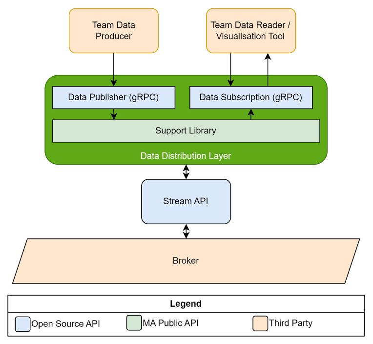

# Support Library Service

The Support Library Service is a critical component of the SECU4 streaming architecture, providing robust data buffering and interpolation capabilities for real-time telemetry data processing.

## Overview

The Support Library Service acts as an intermediary layer between the Stream API and data consumers, offering:

- Real-time data buffering
- Data interpolation
- Flexible data processing

## Architecture

> **Note:** The gRPC interface for the Support Library is planned and will be implemented soon.



## Key Features

### Buffering Module

The buffering module provides two distinct data handling approaches:

#### Sample Data Buffering
- Single parameter per `SampleData` object
- Multiple samples and timestamps per parameter
- Supports various data types:
  - Events
  - Markers
  - CAN Data
  - Errors

#### Timestamp Data Buffering
- Multiple parameters per timestamp
- Unified timestamp-based processing
- Same data type support as Sample Data

### Interpolation Module

The interpolation module provides:

- Default statistical processing:
  - First value
  - Last value
  - Mean
  - Minimum
  - Maximum
- Custom processor support
- Configurable processing frequencies

## Configuration

### Buffering Configuration

```csharp
var bufferingConfig = new BufferingConfiguration(
    subscribedParameters: parameters,
    bufferingWindowLength: 3000,
    slidingWindowPercentage: 5,
    includeMarkerData: true,
    includeEventData: true,
    includeErrorData: true,
    includeCanData: true
);
```

| Parameter | Description | Default |
|-----------|-------------|---------|
| `SubscribedParameters` | List of parameters to subscribe to | null (all parameters) |
| `BufferingWindowLength` | Window length in milliseconds | 3000 ms |
| `SlidingWindowPercentage` | Window sliding interval percentage | 5% |
| `IncludeMarkerData` | Include marker data | false |
| `IncludeEventData` | Include event data | false |
| `IncludeErrorData` | Include error data | false |
| `IncludeCanData` | Include CAN data | false |

### Interpolation Configuration

```csharp
supportLibApi.InterpolationSubscribe(
    subscriptionKey: "unique-key",
    parameterIdentifiers: parameters,
    subscriptionFrequencyHz: 2,
    handler: interpolationResultHandler,
    deliveryFrequencyHz: 2
);
```

| Parameter | Description |
|-----------|-------------|
| `SubscriptionKey` | Unique identifier for the interpolation |
| `ParameterIdentifiers` | List of parameters to process |
| `SubscriptionFrequencyHz` | Data processing frequency |
| `Handler` | Result handler implementation |
| `DeliveryFrequencyHz` | Result delivery frequency |

## Integration

### Stream API Integration

```csharp
var streamApiConfig = new StreamingApiConfiguration(
    StreamCreationStrategy.TopicBased,
    "localhost:9092",
    new List<string>()
);
```

### SQL Race Integration

```csharp
var sqlSessionManager = new SqlSessionManager(
    connectionString,
    subscribedParameters,
    logger
);
```

## Best Practices

1. **Buffering Configuration**
   - Adjust window length based on data rate
   - Consider memory usage when including additional data types
   - Monitor system performance with different sliding window percentages

2. **Interpolation Configuration**
   - Match frequencies to data requirements
   - Consider system resources when processing multiple parameters
   - Use appropriate handlers for different data types

3. **Error Handling**
   - Implement proper error logging
   - Handle connection failures gracefully
   - Monitor buffer overflow conditions

## Example Usage

```csharp
// Initialize components
var supportLibApi = new SupportLibApiFactory().Create(
    streamApiConfig,
    packetReadingConfig,
    bufferingConfig,
    logger,
    sampleDataHandler,
    timestampDataHandler
);

// Start processing
supportLibApi.Initiate();
Task.Run(() => supportLibApi.Start());

// Subscribe to data
supportLibApi.BufferingSubscribe(subscribedParameters);
supportLibApi.InterpolationSubscribe(subscriptionKey, parameters, 2, handler, 2);
```

## Troubleshooting

Common issues and solutions:

1. **High Memory Usage**
   - Reduce buffering window length
   - Filter subscribed parameters
   - Adjust sliding window percentage

2. **Data Latency**
   - Check Stream API connection
   - Verify buffer configuration
   - Monitor system resources

## Related Components

- [Stream API Documentation](../stream-api)
